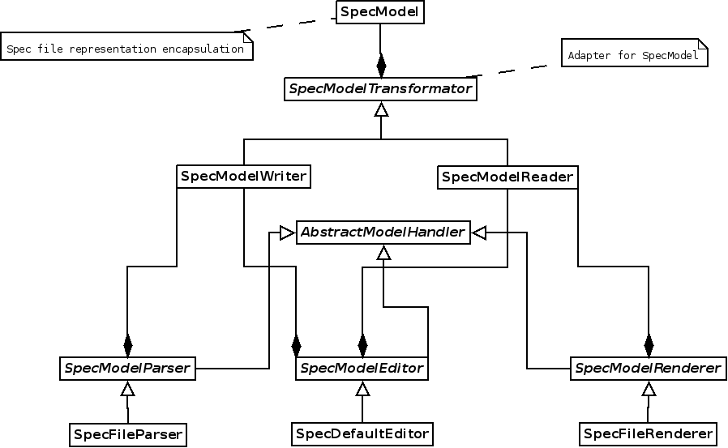

# specker
A simple spec file tool

specker is considered to be a lightweight, flexible and modular tool for
manipulating with spec files.

## Module Online Documentation

All source codes are documented using epydoc syntax
(http://epydoc.sourceforge.net/manual-epytext.html). Online documentation can
be browsed at (updated every ~1 hour):

http://209.132.179.123:8080

## Internal Overview

specker is only a script which helps you to parse command line arguments and
pass it to specker-lib, which can be configured based on arguments. The whole
concept of specker is to centralize all code in modules and be able to use
specker as a library - specker-lib. You can find all provided modules inside
modules/ directory.

specker-lib is designed to centralize manipulation with a spec files using "model
representation", thus model is the main component. This does not mean that you
cannot implement your own model. The design of specker allows you to substitute
every single component with your own, the only thing you have to obey is
interface used between components.

As shown on figure bellow, you see that SpecModel encapsulates a spec (or more
precisely - a package). SpecModelTransformator is used as an adapter, so you can
adapt all calls or use post/pre hooks (like post add hook, post remove hook and
so on). SpecModelManipulators use internaly SpecModelReader and SpecModelWriter
in order to distinguish modification from reading.

SpecModelManipulators are manipulators which operate on a SpecModel. There are
3 main types of manipulators - Parsers, Editors and Renderers.

Parsers are only filling SpecModel. The source can vary - you can use raw spec
file, JSON or even binary representation if you wish.

Editors are designed to modify the SpecModel. You can implement any model
manipulation you wish.

Renders just read the SpecModel and transform them to your representation.
Again, it can vary - you can use raw spec file, JSON or a binary representation.

## Examples

You can study examples situated inside examples/ directory. Every example
documents usage in the header of the source file.

## Bugs?

Feel free to contribute using pull requests, report bugs or request improvements
you wish to see.

